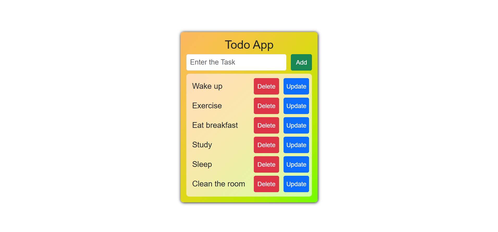

# Todo App

A simple **Todo App** built with **React** and **Bootstrap** that allows users to add, edit, and delete tasks. The app is visually appealing, responsive, and easy to use.

## Features

- Add tasks with a single click.
- Edit existing tasks.
- Delete tasks individually.
- Styled using **Bootstrap** and custom CSS with gradient backgrounds.
- Responsive design for all screen sizes.

## Screenshots

  

## Technologies Used

- **React** 
- **Bootstrap**
- **JavaScript** 
- **CSS** 

## Usage

1. Enter a task in the input field.
2. Click **Add** to save the task.
3. To edit a task, click **Update**, modify the task, and click **Update** again.
4. To delete a task, click the **Delete** button next to it.

